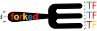
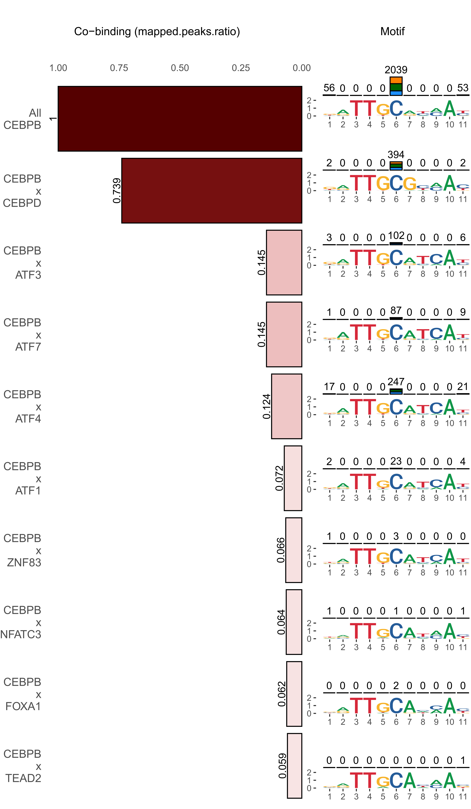
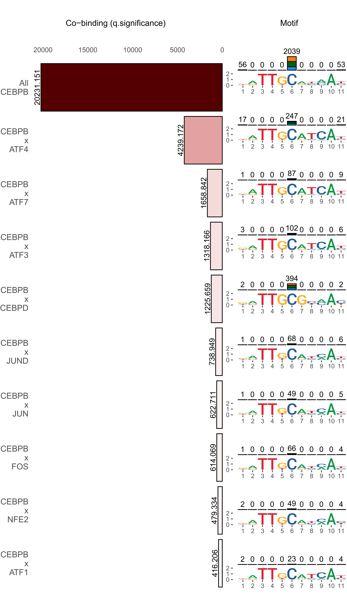

<p align="center">
  
</p> 

### forkedTF
ForkedTF is an R-library that introduces Forked-PMW (FPMW) and Forked-Sequence Logos (F-Logos) to provide a more comprehensive depiction of the sequence affinity of a TF of interest, including its DNA sequence and DNA methylation level, along with a segregated list of partner TFs. Unlike existing methods that combine binding sites of dimer TFs into a single PWM/logo, FPWM and F-Logo represent the PWM and sequence logos of dimer partners as "forked" from the main TF motif. This unique approach employed by forkedTF enhances the accuracy of PWM models for TF dimers, enriching our understanding of TF cooperativity, and opening up new possibilities for precise TFBS prediction.
 
### Current version: 1.3.0
### Installation
Type the following in R console:
```r
if (!require("remotes", quietly = TRUE))
    install.packages("remotes")
if (!require("BiocManager", quietly = TRUE))
    install.packages("BiocManager")

BiocManager::install("benoukraflab/forkedTF")
```
#### Dependencies
   - [TFregulomeR](https://github.com/benoukraflab/TFregulomeR) (>= 2.3)
   - [ggplot2](https://cran.r-project.org/web/packages/ggplot2/index.html) (>= 3.3.0)
   - [gridExtra](https://cran.r-project.org/web/packages/gridExtra/index.html) (>= 2.3)
   - [gridGraphics](https://cran.r-project.org/web/packages/gridGraphics/index.html) (>= 0.4.1)
   - [ggseqlogo](https://cran.r-project.org/web/packages/ggseqlogo/index.html) (>= 0.1)
   - [cowplot](https://cran.r-project.org/web/packages/cowplot/index.html) (>= 1.0.0)
   - [grid](https://www.rdocumentation.org/packages/grid/versions/3.6.1) (>= 3.6.1)

## Documentation
A detailed description of all forkedTF's features is available [here](https://github.com/benoukraflab/forkedTF/wiki).

## Quick usage
#### MiniCofactor Report
This function helps in the exploration of binding partners in a cell line. Input the `mainTF`, `cell` line of interest and the `cobinding_threshold` to generate a PDF report of the binding partners.

```r
library(forkedTF)
miniCofactorReport(TF = "CEBPB", cell = "K562")
```
<div align="center">
<a name="miniCofactorReport"/>
</img>
</a>
</div>

In addition to finding the factor with the highest peak overlap, using the parameter `filterBy="q.significance"` we can compute a -log10(Adjusted P-value) from an enrichment test as implemented in https://github.com/remap-cisreg/ReMapEnrich
```r
miniCofactorReport(TF = "CEBPB", cell = "K562", filterBy = "q.significance")
```
<div align="center">
<a name="miniCofactorReport"/>
</img>
</a>
</div>

#### FPWM creation and plot
Use the `createFPWM` function to extract the motif, from empirical datasets, that a TF uses when binding with a partner TF. `plotFPWM` helps in visualizing the FPWM.
```r
fpwm <- createFPWM(
  mainTF = "CEBPB",
  partners = c("ATF4", "ATF7", "ATF3", "JUND", "FOS", "CEBPD"),
  cell = "K562", 
  forkPosition = 5,
  flipMatrix = FALSE
)

plotFPWM(fpwm, pdfName = "fpwm_plot.pdf")
```
<div align="center">
<a name="fpwm_plot"/>
</img>
</a>
</div>

#### Writing FPWM
Save the FPWM to a local file can be used in matrix scanning or matrix clustering in `transfac` format or `FPWMtransfac` format. `Transfac` format will have a matrix for each interacting partner in the FPWM, while `FPWMtransfac` will output a single matrix.
```r
write.FPWM(FPWM = fpwm, format = "transfac", fileName = "FPWM.tf")
write.FPWM(FPWM = fpwm, format = "FPWMtransfac", fileName = "FPWM.FPWMtf")
```
   
## Cite
A manuscript describing forkedTF has been submitted. If you are currently using forkedTF, please cite us as follows: 

Dyer M, Tirado-Magallanes R, Ghayour-Khiavi A, Lin QXX, Santana-Garcia W, Usefi H, Thomas-Chollier M, Jha S, Thieffry D, and Benoukraf T.
*Representing Transcription Factor Dimer Binding Sites Using Forked-Position Weight Matrices and Forked-Sequence Logos*.
version: 1.3.0, 2024, [website: https://github.com/benoukraflab/forkedTF]

## License
This project is licensed under GNU General Public License - see [LICENSE.txt](./LICENSE.txt) for details.
